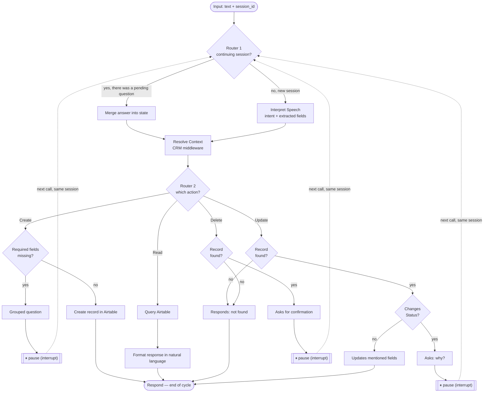

# Agent (LangGraph) — Documentation

This document covers the design of the agent that connects the Siri
Shortcut to the CRM (see `CRM.md` for the data structure and actions).

---

## 1. Input

- The Shortcut uses the **iPhone's native dictation** (Siri already
  transcribes speech). The webhook receives **text**, not audio — no
  transcription node in the graph.

---

## 2. Session / memory model

- Each Shortcut execution ("Hey Siri...") is an **isolated thread** — like
  opening a new conversation, it never inherits context from previous
  executions.
- Within **one execution**, if the agent needs to ask for missing fields
  (wizard) or confirm a delete, that's an exchange of several messages
  *within the same thread*. The Shortcut generates a `session_id` at the
  start of the execution and sends it on every webhook call within that
  same execution.
- Short-term memory within the thread = **the LangGraph checkpointer**,
  indexed by `thread_id` = `session_id`. Lets the graph pause mid-way
  (`interrupt()`) waiting for an answer and resume exactly where it left
  off.
- Long-term memory = **the CRM itself (Airtable)**. We don't store a
  history of past conversations — if the agent needs context about a lead
  (e.g. "Zé isn't interested anymore"), it looks Zé up directly in the
  Leads table.
- If a session is interrupted before finishing (Shortcut fails, person
  hangs up), the partial information **is lost** — nothing is written to
  Airtable until the action is complete/confirmed. There is no resuming
  old sessions.

---

## 3. Layered architecture

```
Webhook (receives message + session_id)
        │
        ▼
Context Middleware ── looks up names/addresses mentioned in the CRM, attaches found data
        │
        ▼
Agent (LangGraph, already with CRM context attached)
```

**Context Middleware** — a deterministic layer (no LLM), separate from
the agent's reasoning. Receives the message, identifies name/address
candidates mentioned, fetches the matching records from Airtable (if they
exist), and hands them already resolved to the agent. Runs on **every**
message, new session or continuing one — it never decides anything about
intent, it only enriches the state with real CRM data so the agent
doesn't have to guess or hallucinate.

The agent never goes directly to Airtable to **search** for things — it
receives data already resolved by the middleware. It only touches
Airtable again at the end of each path, to write (create/update/delete)
or to query (read).

---

## 4. Shared state (State)

```python
class AgentState:
    session_id: str
    current_input: str              # last text received (initial sentence or answer to a question)
    intent: str                     # create | read | update | delete
    target_entity: str              # Lead | Visit | Property
    crm_context: dict                # records resolved by the middleware (lead/property found)
    extracted_fields: dict           # accumulates over the course of the session
    skipped_fields: list[str]        # fields the person said "I don't know" to (only relevant in Create)
    pending_question: str | None    # question currently awaiting an answer
    awaiting_delete_confirmation: bool
    final_response: str | None
```

---

## 5. Graph — two routers + four paths

```
[input: text + session_id]
        │
        ▼
 Router 1 — new session or continuing?
        │
        ├─ continuing (there was a pending_question) ──► merges answer into extracted_fields
        │                                              and resumes the path it was in (without
        │                                              re-classifying intent)
        │
        └─ new
              │
              ▼
        Interpret Speech (1 LLM call: intent + entity + extracted fields)
              │
              ▼
        Router 2 — which action?
              │
   ┌──────────┼──────────┬──────────┐
   ▼          ▼          ▼          ▼
 CREATE      READ       UPDATE     DELETE
```

### CREATE path
```
CRM context (middleware) already attached
        │
        ▼
Are required fields missing? (classification in CRM.md §3)
        │
        ├─ yes → grouped question (CRM.md §4) → interrupt() → pause
        └─ no → write to Airtable → confirmation response → END
```
The only path with a wizard — grouped question, accepts "I don't
know"/"skip", never insists.

### READ path
```
CRM context (if applicable) or direct query (e.g. filter by date)
        │
        ▼
Query Airtable → format response in natural language → END
```
Never writes anything. If the mentioned lead/property doesn't exist, it
says so directly instead of making something up.

### UPDATE path
```
CRM context (must find the record)
        │
        ├─ not found → "I couldn't find that lead/property" → END
        └─ found
              │
              ├─ changes the Lead's Status? ──► asks "why?" (if not already said)
              │                                    │
              │                              interrupt() → pause
              │                                    │
              │                              creates a Visit (Type = "Note", Summary = reason)
              │                              → Lead's Status updates as a side effect
              │                              → END
              │
              └─ factual correction (phone, budget, price, etc.)
                    → updates ONLY the fields the person mentioned
                      (no wizard — doesn't ask for extra fields) → END
```
Only changing **Status** asks for a reason — because it carries context
worth logging as an interaction (same logic as the CREATE → Visit path).
Simple factual corrections stay direct, no questions asked.

### DELETE path
```
CRM context (must find the record)
        │
        ├─ not found → "I couldn't find that lead/property" → END
        └─ found → asks for confirmation → interrupt() → pause
                              │
                              ├─ confirmed → deletes → END
                              └─ denied/ambiguous → cancels, nothing is deleted → END
```

---

## 6. Pause mechanism (`interrupt`)

LangGraph's `interrupt()` halts graph execution mid-way (a question or
confirmation node), the checkpointer saves the state associated with the
`thread_id`. When the Shortcut's next call arrives (same session, with
the person's answer), Router 1 recognizes the session is continuing and
the graph resumes exactly at that point — without going back through
Router 2.

**Implementation rule — idempotency before `interrupt()`:** when a node
resumes after an `interrupt()`, all code *before* that call runs again
from scratch (that's how LangGraph works). A node can pause more than
once within the same session — wizard rule 2 (`CRM.md` §4: "if the answer
only covers part of the group, ask a follow-up only for the field still
missing") means `create_ask` can call `interrupt()` several times in a
row. Because of that:

- **No Airtable write (create/update/delete) may happen before the last
  `interrupt()` in a path resolves.** Concretely: "check whether the Lead
  already exists → otherwise, create a new lead" (`CRM.md` §2.1) may only
  run inside `create_write`, never inside `resolve_context` or
  `create_check_fields`/`create_ask` — otherwise every wizard follow-up
  question would create a duplicate Lead.
- `resolve_context` (the middleware) may only read/search, never create
  records — this follows the general rule already documented, but is made
  explicit here because of the duplication risk.
- The same is already well designed in the Update path:
  `update_create_visit` (creates the Visit/Note) runs **after** the
  "why?" `interrupt()`, not before — keep this order when implementing.

---

## 7. Error cases / fallback

- **Lead/Property mentioned but doesn't exist** (in Read/Update/Delete) →
  clear, direct response, doesn't make anything up or try to fill in
  blanks.
- **Ambiguous name** (e.g. two "Joãos" in the CRM) → another
  `interrupt()`, a question like: "there are two Joãos — João Silva or
  João Costa?"
- **Unrecognizable intent** (noise, Siri misheard) → asks to repeat,
  doesn't assume.

---

## 8. Runtime decisions (current phase: local development only)

Resolved in `docs/superpowers/specs/2026-07-14-agent-runtime-design.md`:

- **LLM**: called via **OpenRouter** (model abstraction) — no specific
  model pinned, it's a config value.
- **Hosting**: no deployment for now. Runs as a **local dev server**
  (`langgraph dev`); the Shortcut connects directly by IP on the same
  Wi-Fi network.
- **Checkpointer**: local **SQLite** — survives dev-server restarts
  during a paused session.
- **Shortcut ↔ webhook payload**: minimal JSON — request
  `{session_id, text}`, response `{session_id, reply_text, done}`.
  `done: false` = graph paused (`interrupt()`); the Shortcut speaks
  `reply_text`, opens dictation again, and calls again with the same
  `session_id`.

Out of scope for now: public hosting, TLS, authentication, tunnel
(ngrok/Tailscale) — to revisit only if the project moves past local dev.

---

## 9. Node specification (for implementation)

Maps each box in the diagrams above to a `StateGraph` node, with its type
(deterministic or LLM) and what it does. Serves as a direct basis for the
code — still without picking the LLM or the hosting (section 8).

| Node | Type | Does |
|---|---|---|
| `session_router` | deterministic | Reads `pending_question` from the state. If it exists, skips `interpret_speech` and `action_router` — goes straight to resuming the active path with the new `current_input` merged into `extracted_fields`. |
| `interpret_speech` | LLM (1 call) | Receives `current_input` (+ session history). Returns `intent`, `target_entity`, `extracted_fields` (structured output). Only runs on a new session. |
| `resolve_context` | deterministic (middleware) | Receives extracted name/address candidates, searches Airtable, fills `crm_context`. Always runs, new session or continuing. |
| `action_router` | deterministic | Reads `intent` and dispatches to one of the 4 subgraphs: `create_*`, `read_*`, `update_*`, `delete_*`. |
| `create_check_fields` | deterministic | Compares `extracted_fields` against the entity's "asked if missing" list (`CRM.md` §3), excluding `skipped_fields`. |
| `create_ask` | deterministic + `interrupt()` | Generates the grouped question (`CRM.md` §4), sets `pending_question`, pauses. |
| `create_write` | deterministic (Airtable tool) | Creates the record (Lead/Visit/Property) in Airtable. Sets `final_response`. |
| `read_query` | deterministic (Airtable tool) | Runs the query (filters by date/status/lead) using `crm_context` or extracted parameters. |
| `read_format_response` | LLM (optional) or template | Converts the query result into a natural-language sentence for `final_response`. |
| `update_check_target` | deterministic | If `crm_context` doesn't have the record → `final_response` = "not found"; otherwise decides whether the field to change is `Status`. |
| `update_ask_why` | deterministic + `interrupt()` | Only runs if the field is `Status` and no reason has been given yet. Pauses waiting for the reason. |
| `update_create_visit` | deterministic (Airtable tool) | Creates a Visit (Type="Note", Summary=reason) and updates the Lead's `Status` as a side effect. |
| `update_write_direct` | deterministic (Airtable tool) | Factual corrections (phone, price, etc.) — updates only the mentioned fields. |
| `delete_confirm` | deterministic + `interrupt()` | If `crm_context` doesn't have the record → "not found". Otherwise asks for confirmation, pauses. |
| `delete_execute` | deterministic (Airtable tool) | Only runs after explicit confirmation ("yes"/"confirm"); otherwise cancels without deleting. |
| `respond` | deterministic | Common final node — formats `final_response` and marks the session as concluded (so the Shortcut knows the cycle ended). |

### Full graph visualization



The dashed lines (`-.->`) show what happens when the Shortcut calls the
webhook again within the same session: it re-enters through Router 1,
which recognizes the pending question and routes back to the right point
— never starts over from scratch.
