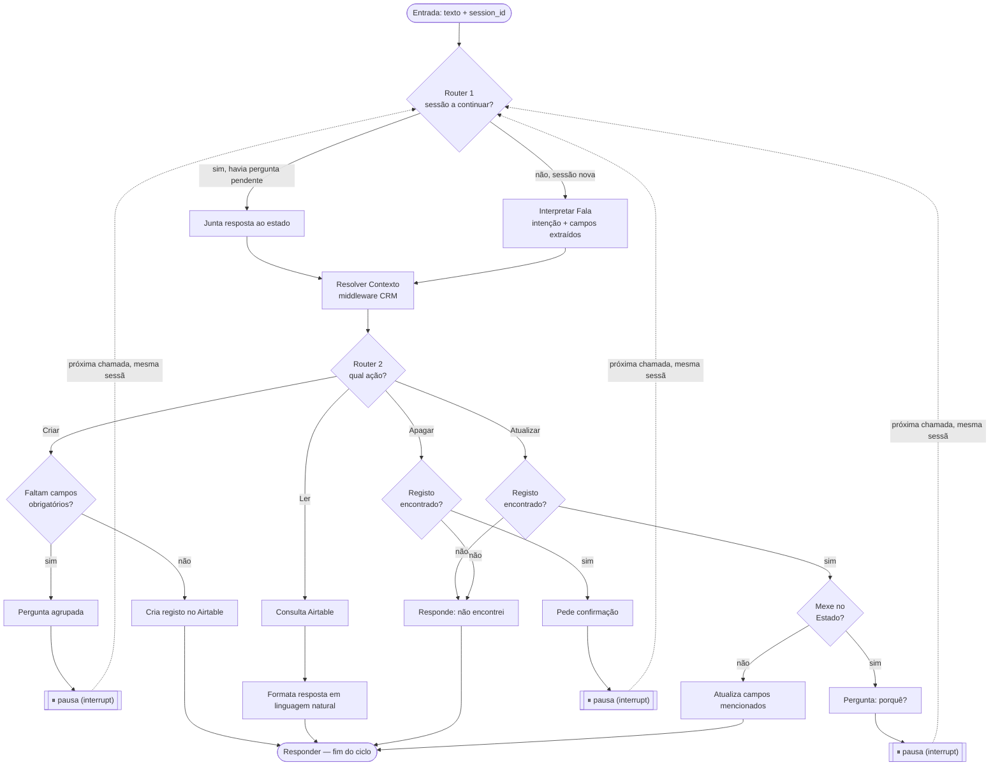

# Agente (LangGraph) — Documentação

Este documento cobre o desenho do agente que liga o Siri Shortcut ao CRM (ver `CRM.md` para a estrutura de dados e ações).

---

## 1. Entrada

- O Shortcut usa o **dictation nativo do iPhone** (Siri já transcreve a fala). O webhook recebe **texto**, não áudio — sem nó de transcrição no grafo.

---

## 2. Modelo de sessão / memória

- Cada execução do Shortcut ("Ei Siri...") é uma **thread isolada** — como abrir uma conversa nova, nunca herda contexto de execuções anteriores.
- Dentro de **uma execução**, se o agente precisar de perguntar campos em falta (wizard) ou confirmar um apagar, isso é uma troca de várias mensagens *dentro da mesma thread*. O Shortcut gera um `session_id` no início da execução e envia-o em todas as chamadas ao webhook dessa mesma execução.
- Memória curta dentro da thread = **checkpointer do LangGraph**, indexado por `thread_id` = `session_id`. Permite ao grafo pausar a meio (`interrupt()`) à espera de resposta e retomar exatamente onde estava.
- Memória de longo prazo = **o próprio CRM (Airtable)**. Não guardamos histórico de conversas passadas — se o agente precisa de contexto sobre um lead (ex: "o Zé já não está interessado"), procura o Zé diretamente na tabela de Leads.
- Se uma sessão for interrompida antes de terminar (Shortcut falha, pessoa desliga), a informação parcial **perde-se** — só se escreve no Airtable quando a ação está completa/confirmada. Não há retoma de sessões antigas.

---

## 3. Arquitetura em camadas

```
Webhook (recebe mensagem + session_id)
        │
        ▼
Middleware de Contexto ── procura nomes/moradas mencionados no CRM, anexa dados encontrados
        │
        ▼
Agente (LangGraph, já com o contexto do CRM anexado)
```

**Middleware de Contexto** — camada determinística (sem LLM), separada do raciocínio do agente. Recebe a mensagem, identifica candidatos a nome/morada mencionados, vai ao Airtable buscar os registos correspondentes (se existirem) e entrega-os já resolvidos ao agente. Corre em **toda** a mensagem, sessão nova ou a continuar — não decide nada sobre intenção, só enriquece o estado com dados reais do CRM para o agente não ter de adivinhar nem alucinar.

O agente nunca vai diretamente ao Airtable **procurar** coisas — recebe os dados já resolvidos pelo middleware. Só volta a tocar no Airtable no fim de cada caminho, para escrever (criar/atualizar/apagar) ou para consultar (ler).

---

## 4. Estado partilhado (State)

```python
class AgentState:
    session_id: str
    entrada_atual: str              # último texto recebido (frase inicial ou resposta a uma pergunta)
    intencao: str                   # criar | ler | atualizar | apagar
    entidade_alvo: str              # Lead | Visita | Imovel
    contexto_crm: dict              # registos resolvidos pelo middleware (lead/imóvel encontrados)
    campos_extraidos: dict          # acumula ao longo da sessão
    campos_salteados: list[str]     # campos que a pessoa disse "não sei" (só relevante em Criar)
    pergunta_pendente: str | None   # pergunta a que se está à espera de resposta
    aguarda_confirmacao_apagar: bool
    resposta_final: str | None
```

---

## 5. Grafo — dois routers + quatro caminhos

```
[entrada: texto + session_id]
        │
        ▼
 Router 1 — sessão nova ou a continuar?
        │
        ├─ a continuar (havia pergunta_pendente) ──► junta resposta a campos_extraidos
        │                                              e retoma o caminho onde estava (sem
        │                                              voltar a classificar intenção)
        │
        └─ nova
              │
              ▼
        Interpretar Fala (1 chamada LLM: intenção + entidade + campos extraídos)
              │
              ▼
        Router 2 — qual a ação?
              │
   ┌──────────┼──────────┬──────────┐
   ▼          ▼          ▼          ▼
 CRIAR      LER       ATUALIZAR   APAGAR
```

### Caminho CRIAR
```
contexto do CRM (middleware) já anexado
        │
        ▼
Faltam campos obrigatórios? (classificação em CRM.md §3)
        │
        ├─ sim → pergunta agrupada (CRM.md §4) → interrupt() → pausa
        └─ não → escreve no Airtable → resposta de confirmação → FIM
```
Único caminho com wizard — pergunta agrupada, aceita "não sei"/"salta", nunca insiste.

### Caminho LER
```
contexto do CRM (se aplicável) ou consulta direta (ex: filtro por data)
        │
        ▼
Consultar Airtable → formatar resposta em linguagem natural → FIM
```
Nunca escreve nada. Se o lead/imóvel mencionado não existir, responde isso diretamente em vez de inventar.

### Caminho ATUALIZAR
```
contexto do CRM (tem de encontrar o registo)
        │
        ├─ não encontrado → "Não encontrei esse lead/imóvel" → FIM
        └─ encontrado
              │
              ├─ mexe no Estado do Lead? ──► pergunta "porquê?" (se ainda não foi dito)
              │                                    │
              │                              interrupt() → pausa
              │                                    │
              │                              cria Visita (Tipo = "Nota", Resumo = motivo)
              │                              → Estado do Lead atualiza como efeito colateral
              │                              → FIM
              │
              └─ correção de facto (telefone, orçamento, preço, etc.)
                    → atualiza APENAS os campos que a pessoa mencionou
                      (sem wizard — não pergunta por campos extra) → FIM
```
Só a mudança de **Estado** pede razão — porque carrega contexto que vale a pena registar como interação (mesma lógica do caminho CRIAR → Visita). Correções simples de facto continuam diretas, sem perguntas.

### Caminho APAGAR
```
contexto do CRM (tem de encontrar o registo)
        │
        ├─ não encontrado → "Não encontrei esse lead/imóvel" → FIM
        └─ encontrado → pede confirmação → interrupt() → pausa
                              │
                              ├─ confirmado → apaga → FIM
                              └─ negado/ambíguo → cancela, nada é apagado → FIM
```

---

## 6. Mecanismo de pausa (`interrupt`)

O `interrupt()` do LangGraph para a execução do grafo a meio (nó de pergunta ou de confirmação), o checkpointer guarda o estado associado ao `thread_id`. Quando a próxima chamada do Shortcut chega (mesma sessão, com a resposta da pessoa), o Router 1 reconhece a sessão a continuar e o grafo retoma exatamente nesse ponto — sem voltar a passar pelo Router 2.

---

## 7. Casos de erro / fallback

- **Lead/Imóvel mencionado mas não existe** (em Ler/Atualizar/Apagar) → resposta clara e direta, não inventa nem tenta preencher em vazio.
- **Nome ambíguo** (ex: dois "Joões" no CRM) → outro `interrupt()`, tipo pergunta: "há dois Joões — João Silva ou João Costa?"
- **Intenção não reconhecível** (ruído, Siri percebeu mal) → pede para repetir, não assume.

---

## 8. Decisões de runtime (fase atual: apenas desenvolvimento local)

Resolvido em `docs/superpowers/specs/2026-07-14-agent-runtime-design.md`:

- **LLM**: chamado via **OpenRouter** (abstração de modelo) — modelo concreto não fixado, é valor de configuração.
- **Hosting**: sem deploy por agora. Corre como **dev server local** (`langgraph dev`); o Shortcut liga diretamente por IP na mesma rede Wi-Fi.
- **Checkpointer**: **SQLite** local — sobrevive a reinícios do dev server durante uma sessão em pausa.
- **Payload Shortcut ↔ webhook**: JSON mínimo — pedido `{session_id, text}`, resposta `{session_id, reply_text, done}`. `done: false` = grafo em pausa (`interrupt()`); o Shortcut fala `reply_text`, volta a ditar, e chama outra vez com o mesmo `session_id`.

Fora de âmbito por agora: hosting público, TLS, autenticação, túnel (ngrok/Tailscale) — a revisitar só se o projeto sair do dev local.

---

## 9. Especificação dos nós (para implementação)

Mapeamento de cada caixa dos diagramas acima para um nó do `StateGraph`, com o tipo (determinístico ou LLM) e o que faz. Serve de base direta para o código — ainda sem escolher o LLM nem o hosting (secção 8).

| Nó | Tipo | Faz |
|---|---|---|
| `router_sessao` | determinístico | Lê `pergunta_pendente` do estado. Se existir, salta `interpretar_fala` e `router_acao` — vai direto retomar o caminho ativo com a nova `entrada_atual` juntada a `campos_extraidos`. |
| `interpretar_fala` | LLM (1 chamada) | Recebe `entrada_atual` (+ histórico da sessão). Devolve `intencao`, `entidade_alvo`, `campos_extraidos` (structured output). Só corre em sessão nova. |
| `resolver_contexto` | determinístico (middleware) | Recebe candidatos a nome/morada extraídos, procura no Airtable, preenche `contexto_crm`. Corre sempre, sessão nova ou a continuar. |
| `router_acao` | determinístico | Lê `intencao` e distribui para um dos 4 subgrafos: `criar_*`, `ler_*`, `atualizar_*`, `apagar_*`. |
| `criar_verificar_campos` | determinístico | Compara `campos_extraidos` com a lista "pergunta se faltar" da entidade (`CRM.md` §3), excluindo `campos_salteados`. |
| `criar_perguntar` | determinístico + `interrupt()` | Gera a pergunta agrupada (`CRM.md` §4), define `pergunta_pendente`, pausa. |
| `criar_escrever` | determinístico (tool Airtable) | Cria o registo (Lead/Visita/Imóvel) no Airtable. Define `resposta_final`. |
| `ler_consultar` | determinístico (tool Airtable) | Executa a query (filtros por data/estado/lead) usando `contexto_crm` ou parâmetros extraídos. |
| `ler_formatar_resposta` | LLM (opcional) ou template | Converte o resultado da query em frase natural para `resposta_final`. |
| `atualizar_verificar_alvo` | determinístico | Se `contexto_crm` não tem o registo → `resposta_final` = "não encontrei"; senão decide se o campo a mudar é `Estado`. |
| `atualizar_perguntar_porque` | determinístico + `interrupt()` | Só corre se o campo for `Estado` e não houver motivo já dito. Pausa à espera do motivo. |
| `atualizar_criar_visita` | determinístico (tool Airtable) | Cria Visita (Tipo="Nota", Resumo=motivo) e atualiza `Estado` do Lead como efeito colateral. |
| `atualizar_escrever_direto` | determinístico (tool Airtable) | Correções de facto (telefone, preço, etc.) — atualiza só os campos mencionados. |
| `apagar_confirmar` | determinístico + `interrupt()` | Se `contexto_crm` não tem o registo → "não encontrei". Senão pergunta confirmação, pausa. |
| `apagar_executar` | determinístico (tool Airtable) | Corre só após confirmação explícita ("sim"/"confirmo"); caso contrário cancela sem apagar. |
| `responder` | determinístico | Nó final comum — formata `resposta_final` e marca a sessão como concluída (para o Shortcut saber que o ciclo terminou). |

### Visualização do grafo completo



As linhas tracejadas (`-.->`) mostram o que acontece quando o Shortcut volta a chamar o webhook dentro da mesma sessão: entra outra vez pelo Router 1, que reconhece a pergunta pendente e reencaminha para o ponto certo — nunca recomeça do zero.
