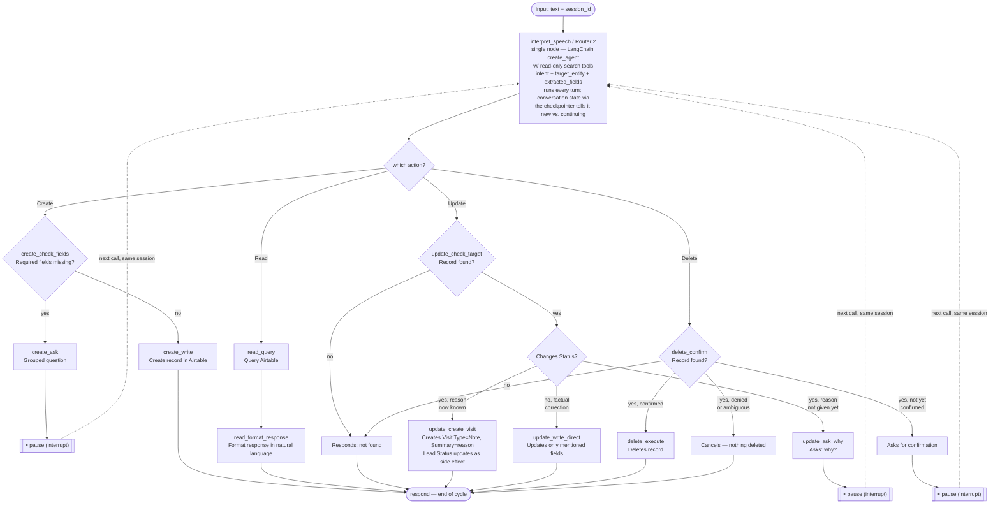

# Agent (LangGraph) — Documentation

This document covers the design of the agent that connects the Siri
Shortcut to the CRM (see `CRM.md` for the data structure and actions).

---

## 1. Input

- The Shortcut uses the **iPhone's native dictation** (Siri already
  transcribes speech). The webhook receives **text**, not audio — no
  transcription node in the graph.

---

## 2. Session / memory model

- Each Shortcut execution ("Hey Siri...") is an **isolated thread** — like
  opening a new conversation, it never inherits context from previous
  executions.
- Within **one execution**, if the agent needs to ask for missing fields
  (wizard) or confirm a delete, that's an exchange of several messages
  *within the same thread*. The Shortcut generates a `session_id` at the
  start of the execution and sends it on every webhook call within that
  same execution.
- Short-term memory within the thread = **the LangGraph checkpointer**,
  indexed by `thread_id` = `session_id`. Lets the graph pause mid-way
  (`interrupt()`) waiting for an answer and resume exactly where it left
  off.
- Long-term memory = **the CRM itself (Airtable)**. We don't store a
  history of past conversations — if the agent needs context about a lead
  (e.g. "Zé isn't interested anymore"), it looks Zé up directly in the
  Leads table.
- If a session is interrupted before finishing (Shortcut fails, person
  hangs up), the partial information **is lost** — nothing is written to
  Airtable until the action is complete/confirmed. There is no resuming
  old sessions.

---

## 3. Layered architecture

```
Webhook (receives message + session_id)
        │
        ▼
Router 2 / interpret_speech ── a single node, built on LangChain's
                                 `create_agent`, bound to read-only search
                                 tools (search_leads/search_imoveis); it
                                 decides for itself whether a name/address
                                 mention is worth looking up in the CRM
        │
        ▼
Deterministic dispatch on `intent` (Create/Read/Update/Delete)
```

**No separate Router 1, no separate Context Middleware.** There is only
one router. Earlier drafts of this design had a deterministic Router 1
whose only job was checking `pending_question` to tell a fresh turn from
a continuation — that node is gone. Router 2 (`interpret_speech`) is built
on LangChain's `create_agent` prebuilt agent constructor, which already
carries conversation state across turns via the checkpointer/thread; "is
this new or a reply to a pending question" is just part of the
conversation the agent already sees, not a separate pre-check. The same
node also absorbs what would have been a deterministic context-resolution
layer: it has `search_leads`/`search_imoveis` bound as tools and decides,
per turn, whether the input mentions a Lead/Property worth looking up,
calling the search tool(s) if it judges that useful, and folding whatever
it finds into the same structured output (`intent`, `target_entity`,
`extracted_fields`) that the dispatch after it reads.

The agent still never *writes* to Airtable except at the end of a path —
the tools bound to this node are read-only (`search_leads`/
`search_imoveis`), so giving it discretion over *when* to search carries
none of the write-duplication risk that discretion over create/update/
delete would (see §6).

---

## 4. Shared state (State)

Canonical source: `src/crmToVoice/models/state.py` (`Intent`/`TargetEntity` are
`Literal` type aliases, not `Enum` — reused verbatim by `interpretation.py`).

```python
class AgentState(BaseModel):
    session_id: str                      # thread_id — one per Shortcut execution; indexes the checkpointer
    current_input: str                   # last text received (initial sentence or answer to a question)
    intent: Intent | None                # create | read | update | delete — set by interpret_speech
    target_entity: TargetEntity | None   # Lead | Visit | Property — set by interpret_speech
    crm_context: dict                    # records Router 2 resolved via its own search tool calls, if it decided to look any up
    extracted_fields: dict               # accumulates over the course of the session (merged explicitly per turn — no automatic reducer, see §6)
    skipped_fields: list[str]            # fields the person said "I don't know" to (only relevant in Create)
    pending_question: str | None         # question currently awaiting an answer via interrupt(); non-None tells interpret_speech/Router 2 this turn is a resume
    awaiting_delete_confirmation: bool   # set by delete_confirm right before its interrupt(); must be True for a "yes" reply to trigger the delete
    final_response: str | None           # reply sent back through the webhook; read by the webhook adapter, not by graph nodes
```

---

## 5. Graph — one router + four paths

```
[input: text + session_id]
        │
        ▼
 Interpret Speech / Router 2 (single node, built on LangChain's
 create_agent, bound to read-only search_leads/search_imoveis tools;
 it decides for itself whether to look anything up, then returns
 intent + entity + extracted fields — a deterministic dispatch on
 `intent` picks the path. Runs on every turn — new session or a reply
 to a pending_question, the agent's own conversation state via the
 checkpointer already tells it which)
        │
   ┌────┼──────────┬──────────┐
   ▼    ▼          ▼          ▼
 CREATE READ      UPDATE     DELETE
```

### CREATE path
```
CRM context (if Router 2 looked anything up) already attached
        │
        ▼
Are required fields missing? (classification in CRM.md §3)
        │
        ├─ yes → grouped question (CRM.md §4) → interrupt() → pause
        └─ no → write to Airtable → confirmation response → END
```
The only path with a wizard — grouped question, accepts "I don't
know"/"skip", never insists.

### READ path
```
CRM context (if applicable) or direct query (e.g. filter by date)
        │
        ▼
Query Airtable → format response in natural language → END
```
Never writes anything. If the mentioned lead/property doesn't exist, it
says so directly instead of making something up.

### UPDATE path
```
CRM context (must find the record)
        │
        ├─ not found → "I couldn't find that lead/property" → END
        └─ found
              │
              ├─ changes the Lead's Status? ──► asks "why?" (if not already said)
              │                                    │
              │                              interrupt() → pause
              │                                    │
              │                              creates a Visit (Type = "Note", Summary = reason)
              │                              → Lead's Status updates as a side effect
              │                              → END
              │
              └─ factual correction (phone, budget, price, etc.)
                    → updates ONLY the fields the person mentioned
                      (no wizard — doesn't ask for extra fields) → END
```
Only changing **Status** asks for a reason — because it carries context
worth logging as an interaction (same logic as the CREATE → Visit path).
Simple factual corrections stay direct, no questions asked.

### DELETE path
```
CRM context (must find the record)
        │
        ├─ not found → "I couldn't find that lead/property" → END
        └─ found → asks for confirmation → interrupt() → pause
                              │
                              ├─ confirmed → deletes → END
                              └─ denied/ambiguous → cancels, nothing is deleted → END
```

---

## 6. Pause mechanism (`interrupt`)

LangGraph's `interrupt()` halts graph execution mid-way (a question or
confirmation node), the checkpointer saves the state associated with the
`thread_id`. When the Shortcut's next call arrives (same session, with
the person's answer), the graph runs through `interpret_speech`/Router 2
again — it's the single entry point, always runs, and (being built on
`create_agent`) already has the prior turns in its conversation state, so
it doesn't need a separate node to tell a fresh turn from a continuation.
Whatever search tool calls it decides to make that turn happen here too,
and dispatch lands back on the same path it paused in.

**Implementation rule — idempotency before `interrupt()`:** when a node
resumes after an `interrupt()`, all code *before* that call runs again
from scratch (that's how LangGraph works). A node can pause more than
once within the same session — wizard rule 2 (`CRM.md` §4: "if the answer
only covers part of the group, ask a follow-up only for the field still
missing") means `create_ask` can call `interrupt()` several times in a
row. Because of that:

- **No Airtable write (create/update/delete) may happen before the last
  `interrupt()` in a path resolves.** Concretely: "check whether the Lead
  already exists → otherwise, create a new lead" (`CRM.md` §2.1) may only
  run inside `create_write`, never inside `interpret_speech` or
  `create_check_fields`/`create_ask` — otherwise every wizard follow-up
  question would create a duplicate Lead.
- `interpret_speech`'s bound tools (`search_leads`/`search_imoveis`) are
  read-only — it is never given a create/update/delete tool, so no matter
  how many times the agent decides to search across repeated re-entries
  before the path's last `interrupt()`, there is no duplication risk. This
  is a hard constraint on which tools this node is ever given, not just a
  convention.
- The same is already well designed in the Update path:
  `update_create_visit` (creates the Visit/Note) runs **after** the
  "why?" `interrupt()`, not before — keep this order when implementing.

---

## 7. Error cases / fallback

- **Lead/Property mentioned but doesn't exist** (in Read/Update/Delete) →
  clear, direct response, doesn't make anything up or try to fill in
  blanks.
- **Ambiguous name** (e.g. two "Joãos" in the CRM) → another
  `interrupt()`, a question like: "there are two Joãos — João Silva or
  João Costa?"
- **Unrecognizable intent** (noise, Siri misheard) → asks to repeat,
  doesn't assume.

---

## 8. Runtime decisions (current phase: local development only)

- **LLM**: called via **OpenRouter** (model abstraction) — no specific
  model pinned, it's a config value.
- **Hosting**: no deployment for now. Runs as a **local dev server**
  (`langgraph dev`); the Shortcut connects directly by IP on the same
  Wi-Fi network.
- **Checkpointer**: local **SQLite** — survives dev-server restarts
  during a paused session.
- **Shortcut ↔ webhook payload**: minimal JSON — request
  `{session_id, text}`, response `{session_id, reply_text, done}`.
  `done: false` = graph paused (`interrupt()`); the Shortcut speaks
  `reply_text`, opens dictation again, and calls again with the same
  `session_id`.

Out of scope for now: public hosting, TLS, authentication, tunnel
(ngrok/Tailscale) — to revisit only if the project moves past local dev.

---

## 9. Node specification (for implementation)

Maps each box in the diagrams above to a `StateGraph` node, with its type
(deterministic or LLM) and what it does. Serves as a direct basis for the
code — still without picking the LLM or the hosting (section 8).

| Node | Type | Does |
|---|---|---|
| `interpret_speech` (a.k.a. Router 2 — the only router) | LLM agent built on LangChain's `create_agent`, bound to read-only tools (`search_leads`/`search_imoveis`) | Receives `current_input` (+ session history from the checkpointer — no separate node needed to tell new vs. continuing, `create_agent` already carries that). Decides for itself whether the input mentions a Lead/Property worth looking up and calls the search tool(s) if so, folding any match into `crm_context`. Returns `intent`, `target_entity`, `extracted_fields` (structured output). The same node's conditional edge then reads `intent` and dispatches to one of the 4 subgraphs: `create_*`, `read_*`, `update_*`, `delete_*`. Runs on every turn, new or continuing. |
| `create_check_fields` | deterministic | Compares `extracted_fields` against the entity's "asked if missing" list (`CRM.md` §3), excluding `skipped_fields`. |
| `create_ask` | deterministic + `interrupt()` | Generates the grouped question (`CRM.md` §4), sets `pending_question`, pauses. |
| `create_write` | deterministic (Airtable tool) | Creates the record (Lead/Visit/Property) in Airtable. Sets `final_response`. |
| `read_query` | deterministic (Airtable tool) | Runs the query (filters by date/status/lead) using `crm_context` or extracted parameters. |
| `read_format_response` | LLM (optional) or template | Converts the query result into a natural-language sentence for `final_response`. |
| `update_check_target` | deterministic | If `crm_context` doesn't have the record → `final_response` = "not found"; otherwise decides whether the field to change is `Status`. |
| `update_ask_why` | deterministic + `interrupt()` | Only runs if the field is `Status` and no reason has been given yet. Pauses waiting for the reason. |
| `update_create_visit` | deterministic (Airtable tool) | Creates a Visit (Type="Note", Summary=reason) and updates the Lead's `Status` as a side effect. |
| `update_write_direct` | deterministic (Airtable tool) | Factual corrections (phone, price, etc.) — updates only the mentioned fields. |
| `delete_confirm` | deterministic + `interrupt()` | If `crm_context` doesn't have the record → "not found". Otherwise asks for confirmation, pauses. |
| `delete_execute` | deterministic (Airtable tool) | Only runs after explicit confirmation ("yes"/"confirm"); otherwise cancels without deleting. |
| `respond` | deterministic | Common final node — formats `final_response` and marks the session as concluded (so the Shortcut knows the cycle ended). |

### Full graph visualization



The dashed lines (`-.->`) show what happens when the Shortcut calls the
webhook again within the same session: it re-enters through
`interpret_speech`/Router 2 — the single entry point — and runs the full
graph again, landing back on the same path it paused in. Once back on that
path, the node re-checks its own condition against the now-updated state
— e.g. `update_check_target` sees the reason is now in `extracted_fields`
and goes straight to `update_create_visit` instead of asking "why?" again;
`delete_confirm` sees `awaiting_delete_confirmation` was already `True`
and routes the person's answer to `delete_execute` or the cancel branch
instead of re-asking for confirmation.
